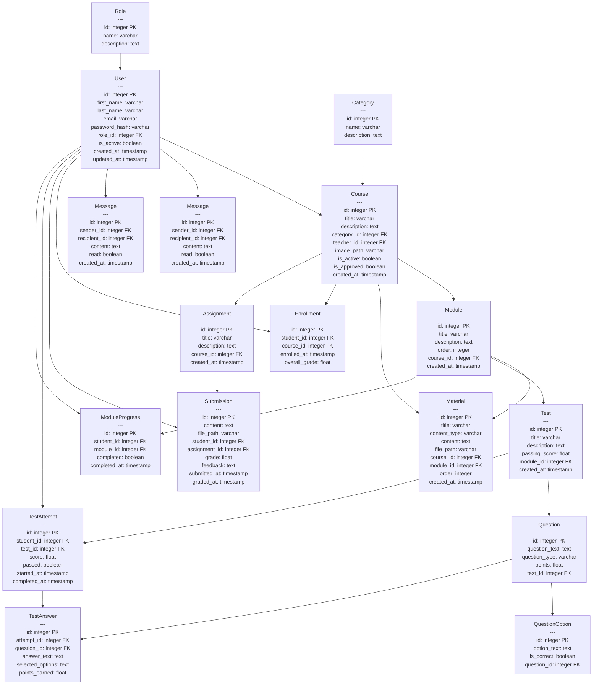

```mermaid
graph TD;
    Role-->User;
    
    User-->Course;
    User-->Message_Sent[Message as Sender];
    User-->Message_Received[Message as Recipient];
    User-->Enrollment;
    User-->Submission;
    User-->TestAttempt;
    User-->ModuleProgress;
    
    Category-->Course;
    
    Course-->Module;
    Course-->Material;
    Course-->Enrollment;
    Course-->Assignment;
    
    Module-->Material;
    Module-->Test;
    Module-->ModuleProgress;
    
    Test-->Question;
    Test-->TestAttempt;
    
    Question-->QuestionOption;
    Question-->TestAnswer;
    
    TestAttempt-->TestAnswer;
    
    Assignment-->Submission;
    
    %% Entity descriptions
    Role["Role
    ---
    id: integer PK
    name: varchar
    description: text"];
    
    User["User
    ---
    id: integer PK
    first_name: varchar
    last_name: varchar
    email: varchar
    password_hash: varchar
    role_id: integer FK
    is_active: boolean
    created_at: timestamp
    updated_at: timestamp"];
    
    Message_Sent["Message
    ---
    id: integer PK
    sender_id: integer FK
    recipient_id: integer FK
    content: text
    read: boolean
    created_at: timestamp"];
    
    Message_Received["Message
    ---
    id: integer PK
    sender_id: integer FK
    recipient_id: integer FK
    content: text
    read: boolean
    created_at: timestamp"];
    
    Category["Category
    ---
    id: integer PK
    name: varchar
    description: text"];
    
    Course["Course
    ---
    id: integer PK
    title: varchar
    description: text
    category_id: integer FK
    teacher_id: integer FK
    image_path: varchar
    is_active: boolean
    is_approved: boolean
    created_at: timestamp"];
    
    Module["Module
    ---
    id: integer PK
    title: varchar
    description: text
    order: integer
    course_id: integer FK
    created_at: timestamp"];
    
    Material["Material
    ---
    id: integer PK
    title: varchar
    content_type: varchar
    content: text
    file_path: varchar
    course_id: integer FK
    module_id: integer FK
    order: integer
    created_at: timestamp"];
    
    ModuleProgress["ModuleProgress
    ---
    id: integer PK
    student_id: integer FK
    module_id: integer FK
    completed: boolean
    completed_at: timestamp"];
    
    Enrollment["Enrollment
    ---
    id: integer PK
    student_id: integer FK
    course_id: integer FK
    enrolled_at: timestamp
    overall_grade: float"];
    
    Test["Test
    ---
    id: integer PK
    title: varchar
    description: text
    passing_score: float
    module_id: integer FK
    created_at: timestamp"];
    
    Question["Question
    ---
    id: integer PK
    question_text: text
    question_type: varchar
    points: float
    test_id: integer FK"];
    
    QuestionOption["QuestionOption
    ---
    id: integer PK
    option_text: text
    is_correct: boolean
    question_id: integer FK"];
    
    TestAttempt["TestAttempt
    ---
    id: integer PK
    student_id: integer FK
    test_id: integer FK
    score: float
    passed: boolean
    started_at: timestamp
    completed_at: timestamp"];
    
    TestAnswer["TestAnswer
    ---
    id: integer PK
    attempt_id: integer FK
    question_id: integer FK
    answer_text: text
    selected_options: text
    points_earned: float"];
    
    Assignment["Assignment
    ---
    id: integer PK
    title: varchar
    description: text
    course_id: integer FK
    created_at: timestamp"];
    
    Submission["Submission
    ---
    id: integer PK
    content: text
    file_path: varchar
    student_id: integer FK
    assignment_id: integer FK
    grade: float
    feedback: text
    submitted_at: timestamp
    graded_at: timestamp"];
```